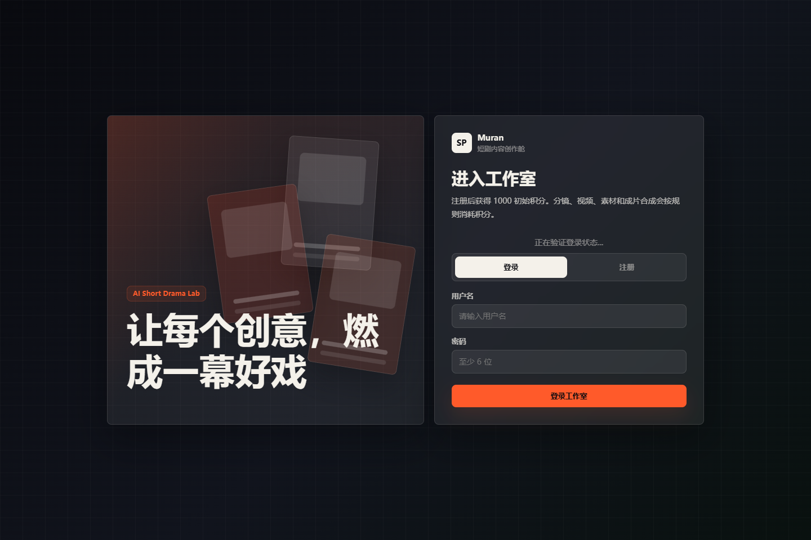
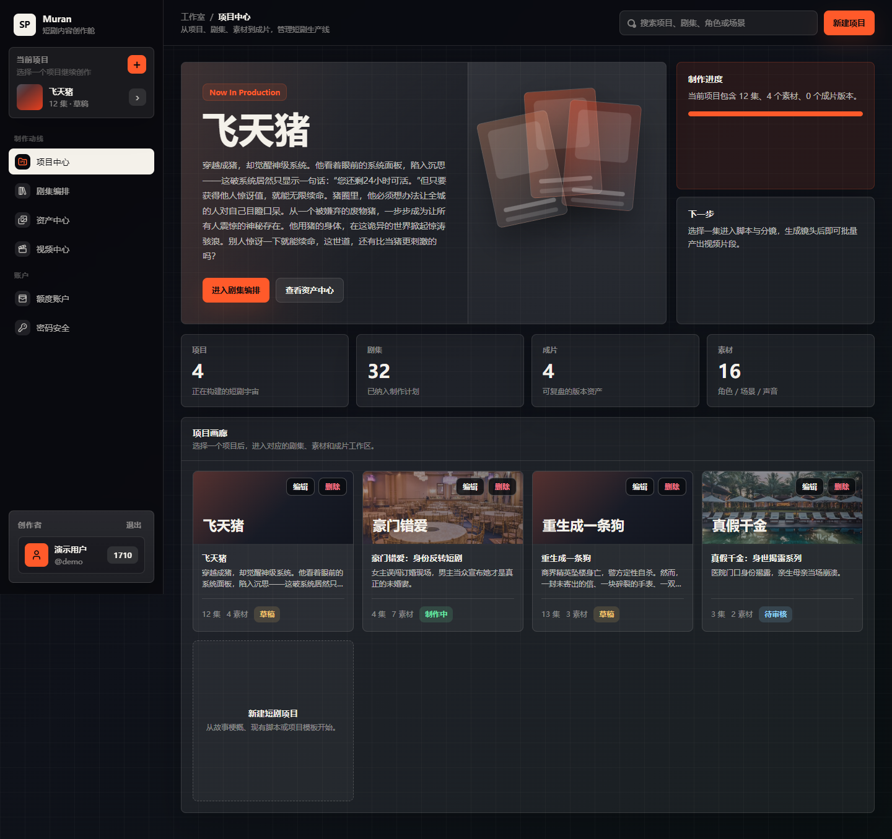
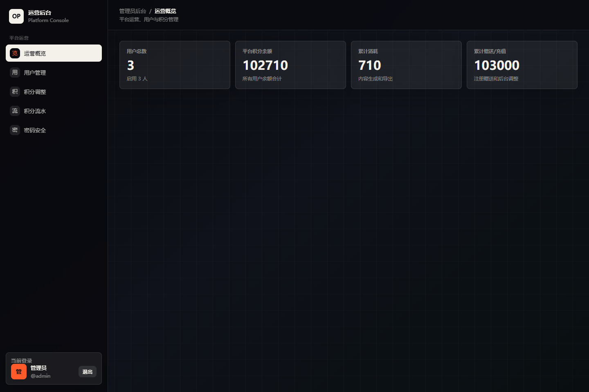

# 幕燃 MVP v3 使用说明

幕燃 MVP v3 是一个短剧内容生产工作台，包含普通创作者工作区和独立管理员后台。

- 创作者工作区：项目、剧集、脚本、分镜、素材、视频生成、成片版本、积分账户、密码修改。
- 管理员后台：平台概览、用户管理、积分调整、积分流水、管理员密码修改。

## 访问地址与账号

本地启动后访问：

- 创作者工作区：`http://localhost:5173`
- 管理员后台：`http://localhost:5173/admin`
- 后端健康检查：`http://localhost:8000/api/health`

默认演示账号：

| 类型 | 用户名 | 密码 | 入口 |
| --- | --- | --- | --- |
| 普通用户 | `demo` | `demo123` | `/` |
| 管理员 | `admin` | `admin123` | `/admin` |



## 启动应用

先启动后端：

```bash
cd backend
pip install -r requirements.txt
uvicorn app.main:app --reload --port 8000
```

再启动前端：

```bash
cd frontend
pnpm install
pnpm dev
```

打开 `http://localhost:5173` 后登录。管理员账号登录后可进入 `/admin`。

## 创作者工作区

登录普通账号后进入项目中心。左侧是主要导航，顶部是当前页面操作区，底部显示当前登录用户和积分余额。



### 1. 项目中心

项目中心用于管理短剧项目。

常用操作：

1. 点击右上角“新建项目”创建短剧项目。
2. 在项目卡片中选择项目，进入对应项目的剧集、素材和视频工作区。
3. 使用项目卡片上的“编辑”“删除”维护项目。
4. 点击“进入剧集编排”继续制作当前项目。

项目是后续剧集、分镜、素材、视频任务和成片版本的归属容器。

### 2. 剧集编排

剧集编排用于管理当前项目下的剧集目录。

常用操作：

1. 点击“新增剧集”添加一集。
2. 点击某一集的“脚本分镜”进入该集的脚本与分镜编辑。
3. 在剧集行中查看分镜数量、版本数量、目标时长和状态。
4. 对已有剧集执行编辑、删除或生成视频。

### 3. 脚本与分镜

进入某一集后，可以维护本集脚本和镜头表。

常用操作：

1. 编辑剧集标题、剧情摘要、正文脚本和目标时长。
2. 点击“智能生成 / 更新分镜”根据脚本生成镜头表。
3. 手动新增、编辑或删除单条镜头。
4. 对单条镜头点击“生成视频”，发起视频生成任务。

分镜生成和视频生成会按积分规则扣减余额；积分不足时系统会阻止操作。

### 4. 资产中心

资产中心用于管理角色、场景、图片和音频参考素材。

常用操作：

1. 点击“新建素材”。
2. 选择“手动上传”上传 JPG、PNG、WebP 图片或声音文件。
3. 选择“AI 生成”输入描述生成角色或场景素材。
4. 对已有素材执行编辑或删除。
5. 角色声音素材可用于后续声音克隆流程。

### 5. 视频中心

视频中心用于查看镜头视频任务和成片版本。

常用操作：

1. 查看每个镜头任务的状态、进度、时长、供应商和更新时间。
2. 对失败或需要重做的镜头点击“重新生成”。
3. 在成片区域点击合成，生成当前剧集的成片版本。
4. 查看或删除历史成片版本。

### 6. 额度账户

额度账户用于查看当前账号积分和用量。

可查看内容：

- 当前积分余额。
- 视频、图片、导出等额度使用情况。
- 积分规则。
- 积分流水。

当前固定积分规则：

| 操作 | 消耗 |
| --- | --- |
| 智能生成短剧大纲 | 20 积分 / 次 |
| 生成或更新分镜 | 20 积分 / 次 |
| 创建视觉素材 | 20 积分 / 个 |
| 音频素材 | 5 积分 / 个 |
| 视频生成 | 10 积分 / 秒 |
| 声音克隆 | 50 积分 / 次 |
| 合成成片 | 30 积分 / 次 |

### 7. 密码安全

在“密码安全”中输入当前密码、新密码和确认密码后提交，即可修改当前登录账号密码。新密码至少 6 位。

## 管理员后台

管理员后台与创作者工作区分离，只处理平台运营、用户和积分，不提供项目制作能力。



### 1. 运营概览

运营概览展示平台核心指标：

- 用户总数。
- 启用用户数。
- 平台积分余额。
- 累计消耗。
- 累计赠送或充值。

### 2. 用户管理

用户管理用于维护平台账号。

常用操作：

1. 查看用户角色、状态、积分、注册时间和最近登录时间。
2. 启用或禁用普通用户。
3. 将普通用户设为子管理员，或取消子管理员权限。
4. 重置普通用户密码。

主管理员账号和当前登录管理员账号有保护规则，不能被禁用或误移除管理员权限。

### 3. 积分调整

积分调整用于给指定用户充值或扣减积分。

操作方式：

1. 选择用户。
2. 输入调整积分，正数表示增加，负数表示扣减。
3. 填写操作原因。
4. 点击“提交调整”。

提交后会同步更新用户余额，并写入积分流水。

### 4. 积分流水

积分流水用于审计用户积分变化。

可查看内容：

- 用户。
- 积分增减。
- 类型和场景。
- 操作说明。
- 操作后余额。
- 创建时间。

### 5. 密码安全

管理员可在后台修改当前登录管理员账号的密码。修改后请使用新密码重新登录。

## 推荐制作流程

1. 登录普通用户账号。
2. 在项目中心创建或选择短剧项目。
3. 进入剧集编排，新建或选择剧集。
4. 在脚本与分镜中完善脚本，并生成分镜。
5. 在资产中心补充角色、场景、图片和声音素材。
6. 对分镜镜头生成视频。
7. 在视频中心检查任务状态，并合成成片版本。
8. 在额度账户查看积分余额和流水。

管理员日常运营流程：

1. 登录管理员后台。
2. 查看运营概览。
3. 在用户管理中处理账号状态和角色。
4. 在积分调整中充值或扣减。
5. 在积分流水中核对记录。

## 注意事项

- AI 生成、视频生成、声音克隆和文件上传依赖后端环境变量与外部服务配置。
- 上传文件经后端存储后以 `/uploads/...` 地址访问。
- 普通用户只能访问自己的项目、剧集和素材。
- 管理员后台不包含内容生产功能。
- 截图基于演示数据，实际项目名称、积分和数量会随数据库变化。
